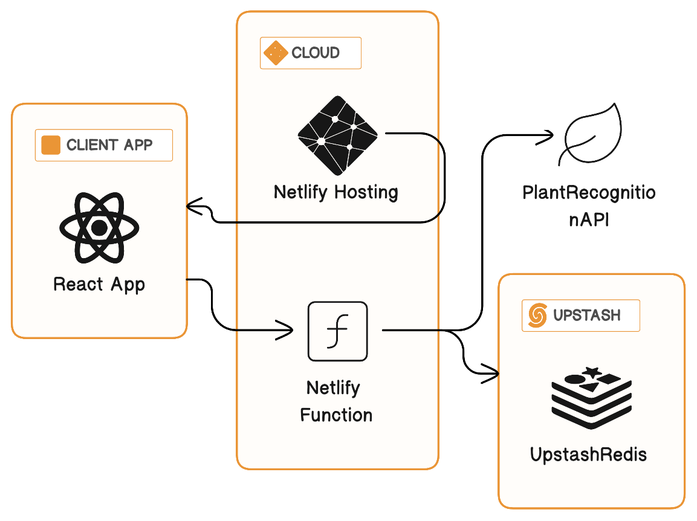
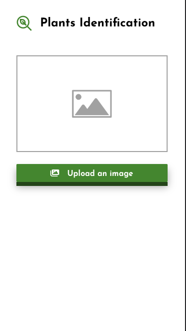
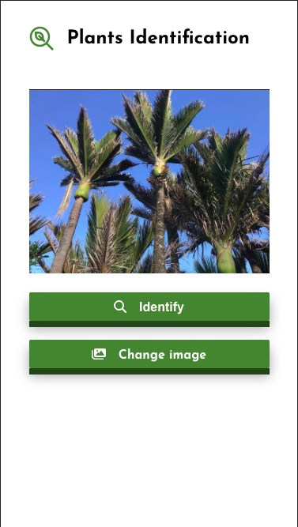
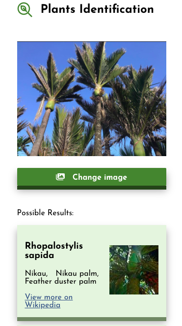

# Plant Identification App

This project is a React single page application deployed on [Netlify](https://www.netlify.com/).
Netlify function is used to respond HTTP requests from the client.
Also, [Upstash/Redis](https://github.com/upstash/upstash-redis) is used to limit the usage of the [Plant Recognition API](https://web.plant.id/)

## Available Scripts

In the project directory, you can run:

### `netlify dev`

Runs the app in the development mode.\
Open [http://localhost:8888](http://localhost:3000) to view it in the browser.

This will run the netlify function as well as the react app at the same time.

## Architecture Overview

## App Design and Screenshots

